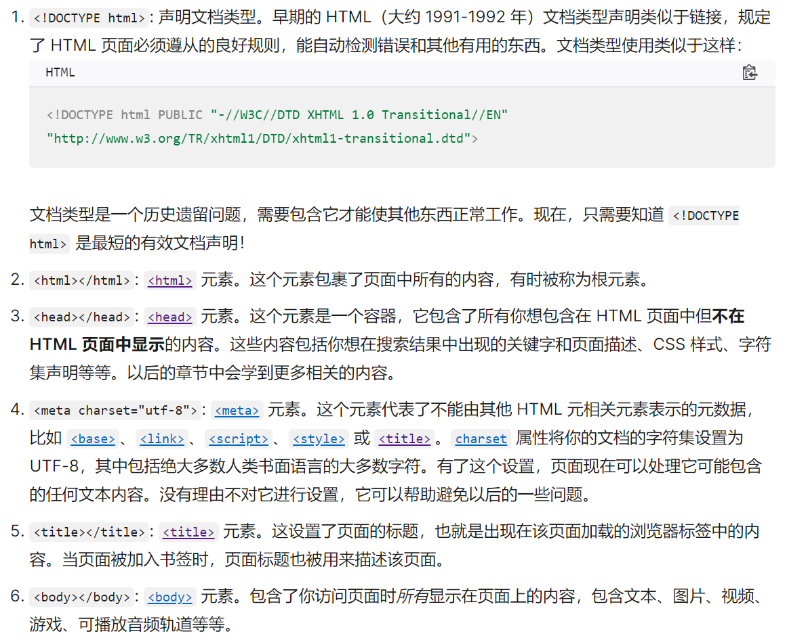

# web 学习路线

## 核心模块

1. Web 标准和最佳实践 (例如辅助功能和跨浏览器兼容)
2. HTML，一门赋予网站内容结构和意义的语言
3. CSS，一门美化网站页面的语言
4. JavaScript，用来为网站创建动态功能的脚本语言
5. 一些有助于现代化客户端 Web 开发的工具

## HTML

- HTML 介绍 (15–20 小时阅读/练习)
- 多媒体与嵌入 (15–20 小时阅读/练习)
- HTML 表格 (5–10 小时阅读/练习)

### 资料

## CSS

- 学习 CSS 的第一步 (10–15 小时阅读/练习)
- 编写 CSS (35–45 小时阅读/练习)
- 添加文本样式 (15–20 小时阅读/练习)
- CSS 布局 (30–40 小时阅读/练习)

## JavaScript

- JavaScript 第一步 (30–40 小时阅读/练习)
- 编写 JavaScript (25–35 小时阅读/练习)
- 客户端 Web API (30–40 小时阅读/练习)
- JavaScript 对象入门 (25–35 小时阅读/练习)
- 异步 JavaScript (25–35 小时阅读/练习)
