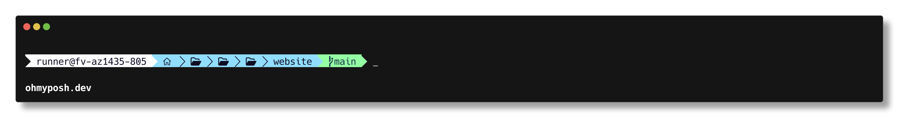
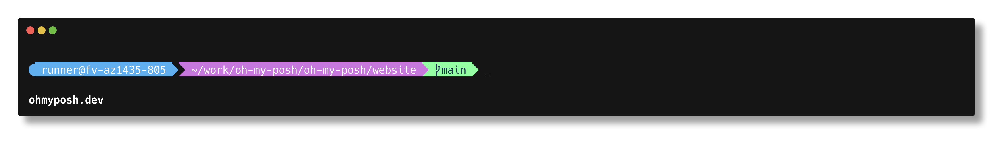
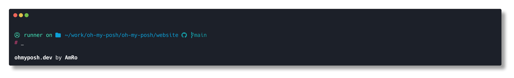
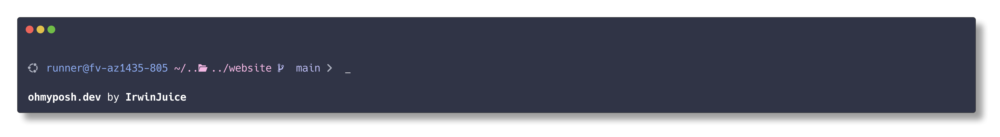

# Oh my posh

PowerShell 提示符美化工具。

## 安装和更新

### 安装

```powershell
winget install JanDeDobbeleer.OhMyPosh -s winget
```

### 检查版本

```powershell
oh-my-posh version
```

> 通过 winget 安装后，通常不需要手动追加 `Path`。

### 更新

```powershell
winget upgrade JanDeDobbeleer.OhMyPosh -s winget
```

## 主题配置（推荐：落地到本地文件）

下面以 `aliens` 为例，执行一次即可：

```powershell
$themeDir = Join-Path $HOME "Documents\PowerShell\themes"
New-Item -ItemType Directory -Force -Path $themeDir | Out-Null

$themeFile = Join-Path $themeDir "aliens.omp.json"
Invoke-WebRequest `
  -Uri "https://raw.githubusercontent.com/JanDeDobbeleer/oh-my-posh/main/themes/aliens.omp.json" `
  -OutFile $themeFile
```

在 `$PROFILE` 中加入：

```powershell
$ompTheme = Join-Path $HOME "Documents\PowerShell\themes\aliens.omp.json"
if (Test-Path $ompTheme) {
    $ompShell = if ($PSVersionTable.PSEdition -eq "Core") { "pwsh" } else { "powershell" }
    oh-my-posh init $ompShell --config $ompTheme | Invoke-Expression
}
```

立即生效：

```powershell
. $PROFILE
```

## 主题配置（不落地文件，直接用 URL）

如果你不想下载主题文件，也可以直接用远程配置：

```powershell
oh-my-posh init pwsh --config "https://raw.githubusercontent.com/JanDeDobbeleer/oh-my-posh/main/themes/agnosterplus.omp.json" | Invoke-Expression
```

## 注意事项

1. 某些环境下 `$env:POSH_THEMES_PATH` 为空，不建议直接依赖它拼接主题路径。
2. 图标显示异常（方块/问号）时，先安装 Nerd Font：

```powershell
oh-my-posh font install Meslo --headless
```

3. 安装字体后，确保终端字体已切换到 Nerd Font（例如 `MesloLGLDZ Nerd Font`）：

- Windows Terminal: `settings.json` 中设置 `profiles.defaults.font.face`
- VS Code: `settings.json` 中设置 `terminal.integrated.fontFamily`

4. 如果使用 Windows PowerShell 遇到 `running scripts is disabled on this system`，建议切换到 PowerShell 7 (`pwsh`) 作为默认终端。

## 主题列表

- [agnosterplus](https://github.com/JanDeDobbeleer/oh-my-posh/blob/main/themes/agnosterplus.omp.json)
  
- [aliens](https://github.com/JanDeDobbeleer/oh-my-posh/blob/main/themes/aliens.omp.json)
  
- [amro](https://github.com/JanDeDobbeleer/oh-my-posh/blob/main/themes/amro.omp.json)
  
- [catppuccin](https://github.com/JanDeDobbeleer/oh-my-posh/blob/main/themes/catppuccin_frappe.omp.json)
  
